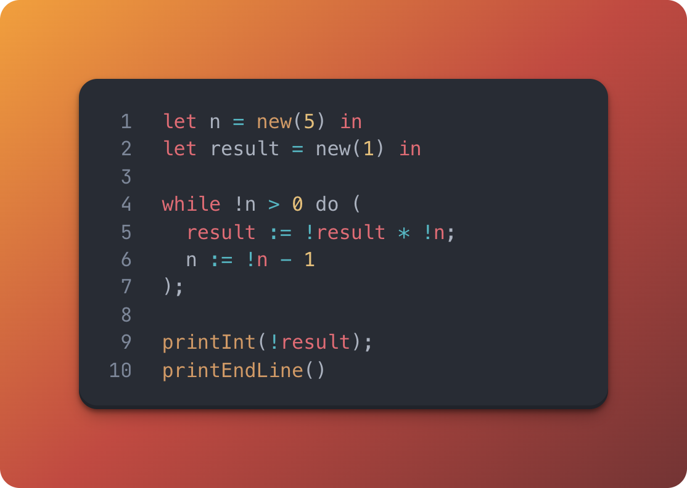

<h1 align="center">CALC Language Compiler</h1>

<div align="center">
  
</div>

<br/>

A functional-imperative language compiler with first-class functions, mutable references, and data structures. Includes both an interpreter and an LLVM compiler.

Report available at: [Report.pdf](REPORT.pdf)

## Features

### Type System

- **Primitive Types**: `int`, `bool`, `unit`, `string`
- **References**: `ref T` for mutable state
- **Functions**: `T1 -> T2` with closures
- **Tuples**: `(T1 * T2 * ...)` for heterogeneous collections
- **Records**: `{field1: T1; field2: T2}` for named fields
- **Lists**: `[T]` for homogeneous collections

### Language Constructs

- **Arithmetic**: `+`, `-`, `*`, `/`, unary `-`
- **Comparisons**: `=`, `!=`, `<`, `<=`, `>`, `>=`
- **Boolean Logic**: `&&`, `||`, `not` (short-circuit evaluation)
- **Let Bindings**: `let x = e in body` and `let x = e1 and y = e2 in body`
- **Functions**: `fun (param: type) -> expr` with lexical scoping
- **Control Flow**: `if/then/else`, `while/do`
- **References**: `new(e)`, `!e`, `:=`, `free(e)`
- **Sequencing**: `e1; e2`
- **Data Access**: Tuple indexing (`.0`, `.1`), record fields (`.field`), list indexing (`[i]`)
- **Pairs**: `fst(e)` and `snd(e)` for 2-tuples
- **I/O**: `printInt`, `printBool`, `printString`, `intToString`, `printEndLine`

### Compiler Features

- **Type Inference**: Static type checking with error messages
- **Optimization**: Constant folding and propagation (enable with `OPT=1` flag)
- **LLVM**: Generates optimized native code
- **Runtime**: Memory management and closure implementation

## Architecture

- **Lexer/Parser** (`lexer.mll`, `parser.mly`): Tokenization and parsing
- **Type Checker** (`typing.ml`): Static type analysis
- **Optimizer** (`optimizer.ml`): Constant folding and propagation
- **Interpreter** (`eval.ml`): Direct AST evaluation
- **LLVM Compiler** (`llvm.ml`): Code generation
- **Runtime** (`mem_runtime.c`, `closure_runtime.c`): Memory and closure support

## Building and Running

```bash
# Build project
make build

# Interactive REPL
make repl

# Compile and run a program
make run FILE=program.calc

# Compile with optimizations
make run FILE=program.calc OPT=1

# Run all programs
make test

# Run programs with optimizations
make test OPT=1

# Clean build artifacts
make clean
```

Place `.calc` files in `programs/` directory. Build artifacts go to `build/`.

## Examples

### Closures and Higher-Order Functions

```ocaml
let make_adder = fun (x: int) ->
  fun (y: int) -> x + y in
let add10 = make_adder(10) in
printInt(add10(5))
```

### Tuples and Records

```ocaml
let point = {x = 10; y = 20} in
let pair = (point.x, point.y) in
printInt(pair.0 + pair.1)
```

### Pairs with fst/snd

```ocaml
let p = (42, 100) in
printInt(fst(p));
printInt(snd(p))
```

### Lists and Iteration

```ocaml
let numbers = [1, 2, 3, 4, 5] in
let i = new(0) in
while !i < 5 do (
  printInt(numbers[!i]);
  i := !i + 1
)
```

### Mutable State

```ocaml
let counter = new(0) in
let n = new(5) in
while !n > 0 do (
  counter := !counter + !n;
  n := !n - 1
);
printInt(!counter)
```

---

**Authors**: Wiktor Szydłowski (75135), Valerii Matviiv (75176)

> *"There are only two kinds of languages: the ones people complain about and the ones nobody uses."*
>
> **Bjarne Stroustrup**
